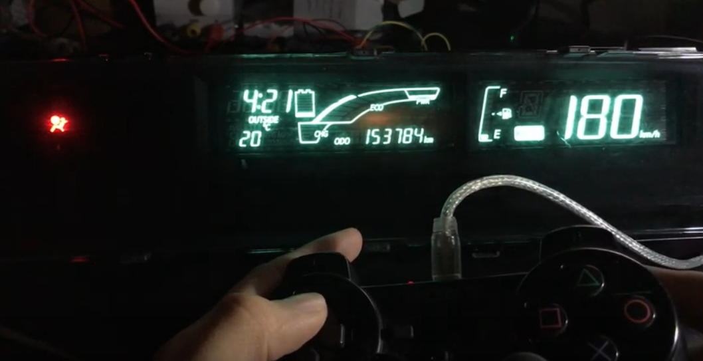

# aqua-meter-joy

アクアのスピードメーターをPS3コントローラで動かす  
Operate PriusC speedometer with PS3 controller

※一瞬で作ったPoCです。更新の予定はありません。

## Demo
https://www.youtube.com/watch?v=5ZJSc0vtP5E

# Requirements
- トヨタ・アクア (NHP-10)で2013年モデルのスピードメーター
- CANインターフェイス
- PS3コントローラ

# INSTALL
```
git clone https://github.com/shutingrz/aqua-meter-joy
cd aqua-meter-joy
pip3 install -r ./requirements.txt
```
# Use
```
$ python3 ./main.py
```

# キー割り当て
- R2: 車速 (スロットルをあける)
- 十字キー上: 外気温を1度上げる
- 十字キー下: 外気温を1度下げる
- 十字キー右: HVインジケータの目盛りを1増やす
- 十字キー左: HVインジケータの目盛りを1減らす
- Circle: シフトポジションを消灯
- Cross: シフトポジションをNにする
- Square: シフトポジションをPにする
- Triangle: シフトポジションをRにする
